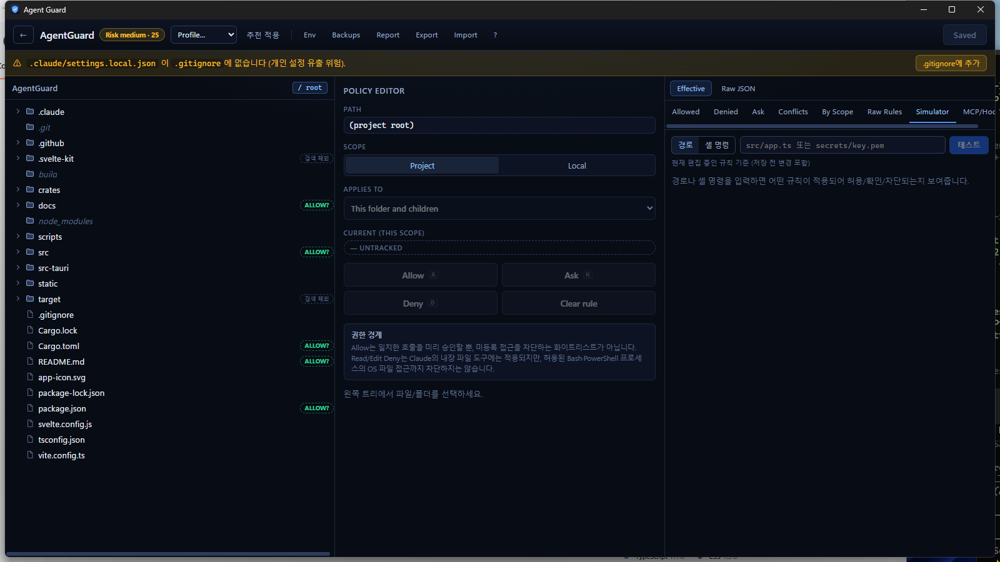

# Agent Guard

Agent Guard is a local-first desktop policy editor for coding agents.

It helps Windows users safely configure what Claude Code and other local coding
agents can access inside a project — without having to understand `settings.json`.

## Core Ideas

- Explicit drive/folder rules — Deny sensitive paths, Allow work folders
- Local-only processing (no network, no telemetry)
- Visual project boundary editor (Explorer-style Allow / Ask / Deny)
- User / Project / Local settings support
- Effective access preview (merged result across scopes)
- Backup + diff before every save

## App Preview



## Status

The v0.1 desktop app is functional and under active development. It uses
**Tauri 2 + SvelteKit (Svelte 5) + TypeScript + Rust + SQLite**; see the
[live documentation site](https://geniuskey.github.io/AgentGuard/) and
[`docs/tech-stack.md`](docs/tech-stack.md) for details.

## Development

Prerequisites: Node 20+, Rust (stable), and — for the desktop shell — the
[Tauri 2 prerequisites](https://v2.tauri.app/start/prerequisites/) for your OS.

```bash
npm install              # frontend deps

# Core logic (pure Rust, no WebView needed — runs anywhere)
cargo test -p agentguard-core

# Frontend (static SPA build + typecheck)
npm test
npm run build
npm run check

# Static documentation site (output: pages-dist/)
npm run docs:build

# Optional live Claude Code permission probes (authenticated CLI + API usage)
npm run test:claude-permissions

# Full desktop app (needs Tauri prerequisites; Windows is the primary target)
npm run tauri dev        # launches the window
npm run tauri build      # produces the installer
```

### Windows prerelease

Run **Actions → Build Windows Release → Run workflow** to create or update the
`v0.1.0` GitHub pre-release. The workflow attaches an NSIS setup EXE, an MSI,
and an unsigned portable EXE. The portable build still requires the Microsoft
WebView2 Runtime and may trigger Windows SmartScreen until code signing is set up.

The release workflow rejects inconsistent versions. `package.json`,
`package-lock.json`, the Cargo workspace, and `src-tauri/tauri.conf.json` must
all remain at the current development version, `0.1.0`.

The live permission probe uses isolated temporary settings and does not modify
your user or project settings. It verifies a PowerShell wildcard Allow, Deny
precedence over a CLI Allow, and the `Invoke-WebRequest` web-block rule.

Layout: `crates/agentguard-core` holds all Tauri-independent logic (policy
conversion, risk scoring, storage) so it stays unit-testable on any host;
`src-tauri` is the thin Tauri 2 shell; `src` is the SvelteKit frontend.

## Documentation

| 문서 | 내용 |
|---|---|
| [docs/user-guide.md](docs/user-guide.md) | 사용자 가이드 — 인앱 가이드(`/guide`)와 동일 원본, GitHub Pages 재사용 가능 |
| [docs/requirements.md](docs/requirements.md) | 원본 요구사항서 (v0.1) |
| [docs/architecture.md](docs/architecture.md) | 시스템 아키텍처, Rust 모듈, Tauri command 계약 |
| [docs/policy-model.md](docs/policy-model.md) | 중립 정책 모델 ↔ settings.json 변환 (팬아웃/왕복) |
| [docs/effective-policy.md](docs/effective-policy.md) | 병합 알고리즘, 정책 모델, 충돌 탐지, Preview |
| [docs/data-model.md](docs/data-model.md) | SQLite 스키마, app-config, 백업 규칙 |
| [docs/risk-scanner.md](docs/risk-scanner.md) | 민감 경로 스캐너, 리스크 점수 함수 |
| [docs/security.md](docs/security.md) | 보안 원칙, 경고 규칙, Secret 감지 |
| [docs/ui-spec.md](docs/ui-spec.md) | 화면·상태·컴포넌트 명세 |
| [docs/tech-stack.md](docs/tech-stack.md) | 기술 스택 트레이드오프 & 권장안 (미확정) |
| [docs/roadmap.md](docs/roadmap.md) | 수직 슬라이스 우선 마일스톤 + 커버리지 추적표 |
| [docs/claude-code-settings-plan.md](docs/claude-code-settings-plan.md) | Claude Code 설정 확장 검토 — 갭 분석, Phase 계획, 개선 백로그 |
| [docs/open-issues.md](docs/open-issues.md) | 오픈 이슈 결정 & 근거 |

## Key Design Decisions

- **경로 정책은 `Tool(specifier)`로 팬아웃** — Claude Code는 도구 중심 permission을
  사용하므로 "Allow `src/`"는 `Read/Edit(./src/**)`로 확장된다(파일 권한 검사가 매칭하는 도구는 Read·Edit뿐).
- **정책은 명시적 경로 규칙만으로 통제** — 민감 경로는 폴더 단위 Deny, 작업 폴더는 Allow.
  deny-by-default 모드(`defaultMode: "dontAsk"`)는 폐기했고, 파일에 남은 값은 저장 시 제거한다.
  매칭 규칙이 없는 경로는 Claude Code 기본 동작(실행 시 확인)을 따른다.
- **앱 메타데이터는 SQLite에만** — `settings.json`에는 순수 규칙만 기록하고 알 수 없는
  필드는 무손실 보존한다.
